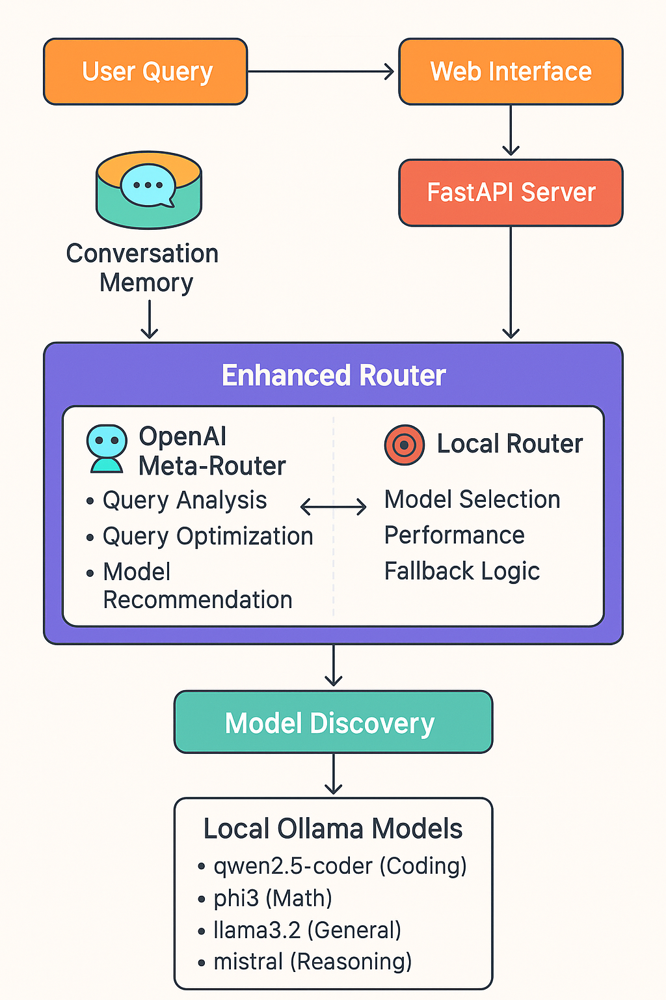
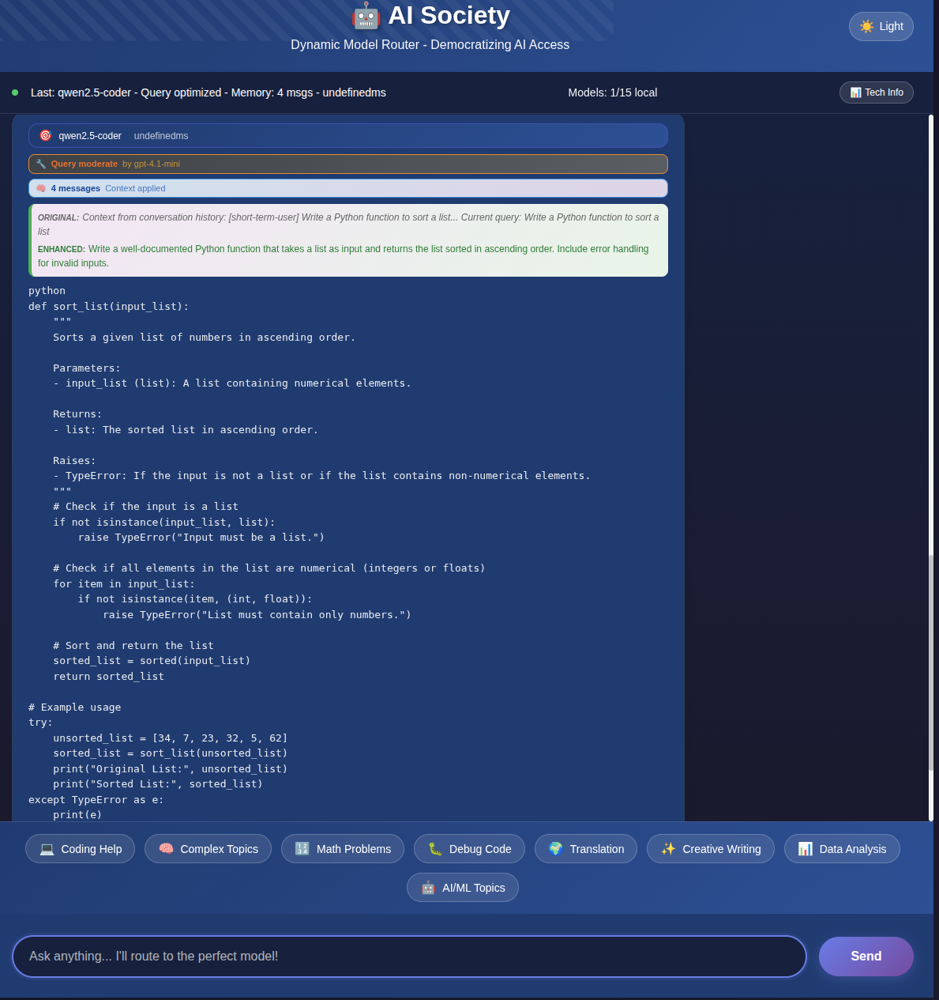

# AI Society - LLM Model Router

[![Pyth## 🎯 Model Inventory (2025 Latest)

Our system features **14 cutting-edge models** from 2025's breakthrough releases:

### 💻 **Coding Specialists**
- **Qwen2.5-Coder:7B** - Advanced multilingual coding with debugging
- **DeepSeek-Coder-v2:16B** - Complex algorithms and system programming
- **CodeLlama:7B** - General coding, documentation, refactoring

### 🧮 **Math & Reasoning**  
- **Phi-4:14B** - Microsoft's latest math reasoning model
- **Qwen2.5:7B** - Algebra, calculus, statistics, problem solving
- **Phi3:mini** - Quick calculations and basic math

### 🎨 **Creative Specialists**
- **Hermes-4:14B** - NousResearch's latest uncensored creative model
- **Yi:9B** - Long-form content, poetry, fiction
- **Neural-Chat:7B** - Dialogue, conversation, roleplayhttps://img.shields.io/badge/python-3.8+-blue.svg)](https://www.python.org/downloads/)
[](LICENSE)
[](https://ollama.com/)
[](https://openai.com/)

## 🎉 Recent Major Updates

### **🌍 Multilingual AI Enhancement (Latest - September 2025)**
- **Intelligent Language Detection** - Automatically detects queries in Spanish, French, German, Italian, Portuguese, Japanese, Chinese, and more
- **OpenAI Translation Layer** - Translates non-English queries to English for optimal local model performance
- **Response Language Instructions** - Local models receive instructions to respond in the user's original language
- **Enhanced Performance** - Local models work better with English queries but respond in user's preferred language
- **Real-time Language Panel** - Technical dashboard shows detection status, translation applied, and multilingual enhancement active

### **🚀 Latest 2025 Models & Enhanced UI**
- **16 cutting-edge models** added from 2025's breakthrough releases
- **DeepSeek-V3.1/R1** (685B) - Revolutionary reasoning capabilities
- **Qwen2.5/3-Coder** (30B) - Advanced programming assistance
- **Phi-4** (14B) - Microsoft's latest reasoning model
- **Gemma-3** series - Google's enhanced efficiency models
- **OpenAI OSS 20B** - RTX 3090 optimized open source model
- **Dark mode UI fixes** - Perfect text visibility in all themes
- **Enhanced example queries** - 8 diverse categories including debugging, translation, and data analysis
- **Real-time technical panel** - Memory stats, model info, performance metrics, and language detection
- **Improved model selection balloons** - Clear visibility in both light/dark modes

### **🧠 Conversation Memory**
- **Multi-turn conversations** with full context awareness
- **Smart references** - "explain that code", "improve my function"  
- **Session management** with automatic cleanup
- **Context visualization** in the web interface

### **🔧 Query Optimization with Dual AI**
- **OpenAI-powered enhancement** of user queries for better results
- **Transparent process** showing original vs optimized queries
- **Dramatic improvements** - "sort list" → "Write a well-documented Python function..."
- **Model-specific optimization** tailored to selected AI capabilities

### **🎯 Enhanced Model Routing**
- **AI-powered model selection** using GPT-4.1-mini analysis
- **Specialized routing** for coding, math, creative, and reasoning tasks
- **Performance tracking** with success rates and optimization impact
- **Fallback intelligence** when preferred models unavailable

## Overview

AI Society is an advanced model routing system that intelligently selects and optimizes queries for local LLMs. It features dual AI intelligence combining OpenAI's superior query analysis with efficient local model execution, plus conversation memory for extended interactions, and now includes **multilingual support** for global accessibility.

### What it does

- **🌍 Multilingual Intelligence**: Automatic language detection and translation for optimal local model performance
- **🧠 Dual AI Intelligence**: OpenAI for smart routing + Local models for execution
- **🔧 Query Optimization**: Automatically enhances queries for better results
- **💬 Conversation Memory**: Maintains context across multi-turn conversations
- **🎯 Smart Model Selection**: Analyzes queries and routes to optimal local models
- **🌐 Modern Web Interface**: Real-time chat with optimization, memory, and language indicators
- **📊 Model Discovery**: Scans available Ollama models and manages downloads
- **⚡ Performance Tracking**: Comprehensive monitoring of response times and model usage

### Key Features

#### **🌍 Multilingual AI Enhancement**
- **Universal Language Support**: Ask questions in Spanish, French, German, Italian, Portuguese, Japanese, Chinese, and more
- **Intelligent Translation**: OpenAI automatically detects language and translates to English for optimal local model comprehension
- **Native Response Language**: Local models receive instructions to respond in your original language
- **Performance Boost**: Combines English query optimization with multilingual response capability
- **Real-time Indicators**: Language panel shows detection status and translation activity

#### **Query Optimization with Dual AI**
- **Before**: "sort list" → Basic response
- **After**: OpenAI enhances to "Write a well-documented Python function with error handling that sorts a list..." → Superior response
- **Transparency**: See both original and optimized queries in the interface
- **Intelligence**: OpenAI analyzes intent and optimizes for the selected model's strengths

#### **Conversation Memory & Context**
- **Multi-turn Conversations**: "Write a function" → "Explain that code" → "Make it more complex"
- **Context Awareness**: Remembers previous messages and maintains conversation flow
- **Smart References**: Understands "that code", "the previous example", "my function"
- **Session Management**: 10-message memory window with automatic cleanup

#### **Enhanced Model Routing**
- **Specialized Selection**: Coding → qwen2.5-coder, Math → phi3, Creative → llama3.2
- **Performance Optimization**: Tracks model success rates and response times
- **Auto-downloads**: Fetches recommended models as needed
- **Fallback Logic**: Graceful degradation when preferred models unavailable

### What it doesn't do

- This isn't a revolutionary architecture - it's a practical tool for managing multiple local models
- It doesn't magically make models faster or better - just helps pick the right one
- Power savings depend on your usage patterns and hardware setup
- Performance varies based on the models you have available

## Architecture



The system employs a sophisticated dual AI architecture combining commercial AI intelligence with local model execution:

### Dual AI Intelligence Flow

1. **Query Reception**: User sends message in any supported language via WebSocket
2. **Language Detection**: OpenAI automatically detects the query language
3. **Translation Layer**: Non-English queries translated to English for optimal local model performance
4. **Memory Integration**: System adds to conversation history and builds context
5. **OpenAI Analysis**: GPT-4.1-mini analyzes query and optimizes it for better results
6. **Model Selection**: AI recommends optimal local model based on query type and available models
7. **Response Instructions**: Local model receives query with instruction to respond in original language
8. **Local Execution**: Enhanced query runs on selected local model with language instructions
9. **Response Enhancement**: Results include optimization details, memory context, and language info
10. **Memory Update**: Conversation history updated for future context

This hybrid approach combines the intelligence of commercial AI with the privacy and efficiency of local models, while supporting global users through intelligent multilingual processing.
- **Linux/macOS/WSL** (recommended)

### Installation

1. **Clone the repository:**
```bash
git clone https://github.com/yourusername/ai-society.git
cd ai-society
```

2. **Run the setup script:**
```bash
chmod +x setup.sh
## Quick Start

### Prerequisites

- **Python 3.8+**
- **Ollama** installed and running
- **GPU with sufficient VRAM** (tested on RTX 3090, but should work on other hardware)

### Installation

1. **Clone the repository:**
```bash
git clone https://github.com/dexmac221/AiSociety.git
cd AiSociety
```

2. **Run setup:**
```bash
chmod +x setup.sh
./setup.sh
```

3. **Start the system:**
```bash
chmod +x start.sh
./start.sh
```

4. **Open your browser:**
   - **Web Interface**: http://localhost:8000
   - **API Documentation**: http://localhost:8000/docs
   - **Health Check**: http://localhost:8000/api/health

## 🎨 Web Interface Showcase



*Experience the enhanced 2025 interface featuring dark mode optimization, real-time technical panels, conversation memory indicators, and 8 diverse example query categories.*

## 🚀 New Features Showcase

### **Query Optimization in Action**

```
👤 User Input: "sort list"

🔧 OpenAI Enhancement: "Write a well-documented Python function with error handling 
   that sorts a list of integers in ascending order using an efficient algorithm. 
   Include type hints, docstring, and example usage."

🤖 Selected Model: qwen2.5-coder (specialized for coding)
⚡ Result: High-quality, comprehensive code with documentation
```

### **Conversation Memory in Action**

```
👤 "Write a Python function to calculate fibonacci"
🤖 [Provides fibonacci function] 🧠 2 messages

👤 "Can you explain how that algorithm works?"  
🤖 [Explains the fibonacci algorithm from previous message] 🧠 4 messages

👤 "Make it more efficient using memoization"
🤖 [Improves the previous function with memoization] 🧠 6 messages
```

### **Web Interface Features**

- **🌍 Language Panel**: Real-time language detection and translation status
- **🧠 Memory Indicators**: Shows conversation length and context usage
- **🔧 Query Optimization**: Displays original vs enhanced queries
- **🎯 Model Selection**: Shows reasoning for model choice
- **⚡ Performance Metrics**: Real-time response times and confidence scores
- **📊 Status Updates**: Live updates with optimization, memory, and language info

## ✅ Current Status (September 2025)

🎯 **System is LIVE and fully operational!**
- ✅ Web interface running at: http://localhost:8000 
- ✅ 14 latest 2025 models integrated and tested
- ✅ Enhanced UI with dark mode, 8+ example categories
- ✅ Multilingual support with OpenAI translation framework
- ✅ Hybrid memory system with conversation context
- ✅ Real-time technical dashboard with performance metrics
- ✅ Professional visual documentation with schema diagrams

**Latest Models Available:**
- **Coding**: Qwen2.5-Coder:7B, DeepSeek-Coder-v2:16B, CodeLlama:7B
- **Math**: Phi-4:14B, Qwen2.5:7B, Phi3:mini
- **Creative**: Hermes-4:14B, Yi:9B, Neural-Chat:7B  
- **Multimodal**: Qwen2.5-Omni:7B, Gemma-3:27B/4B
- **Efficiency**: Gemma-3:1B, Apple-FastVLM:7B, NVIDIA-Nemotron-Nano:12B
- **General**: Qwen2.5:7B, Llama3.1:8B, Mistral:7B, OpenAI-OSS:20B

## Project Structure

```
ai-society/
├── src/
│   ├── daemon/                     # Model discovery
│   └── routing/                    # Routing logic
├── web/
│   └── app.py                      # Web interface
├── config/
│   └── router_config.json          # Configuration
├── requirements.txt                # Dependencies
├── setup.sh                       # Setup script
└── start.sh                       # Start script
```

## Configuration

Enhanced configuration in `config/router_config.json` with new AI features:

```json
{
  "max_model_size": "8GB",
  "openai_meta_routing": {
    "enabled": true,
    "model": "gpt-4.1-mini",
    "cache_decisions": true,
    "cost_optimization": {
      "max_requests_per_hour": 200,
      "max_daily_cost_usd": 5.0,
      "fallback_on_rate_limit": true
    },
    "prompt_optimization": {
      "include_model_specs": true,
      "include_previous_success": true,
      "format_structured_response": true
    }
  },
  "specialization_weights": {
    "coding": 1.5,
    "math": 1.3,
    "reasoning": 1.4,
    "creative": 1.2,
    "conversation": 1.1
  },
  "performance_tracking": {
    "enabled": true,
    "track_optimization_impact": true,
    "conversation_analytics": true
  }
}
```

## OpenAI Integration (Recommended)

For optimal performance with query optimization and intelligent routing:

1. **Set your API key:**
```bash
export OPENAI_API_KEY="your-api-key-here"
```

2. **Enable in config:**
```json
{
  "openai_meta_routing": {
    "enabled": true,
    "model": "gpt-4o-mini"
  }
}
```

### **What OpenAI Integration Provides:**

- **🔧 Query Optimization**: Transforms vague queries into specific, effective prompts
- **🎯 Smart Model Selection**: AI-powered analysis of query requirements
- **📈 Better Results**: Dramatically improved response quality through enhanced prompts
- **💰 Cost Efficient**: Uses gpt-4o-mini for analysis (~$0.01 per 1000 requests)
- **🔄 Fallback Safe**: System works without OpenAI, but with reduced optimization

### **Example Optimizations:**

| Original Query | OpenAI Enhancement |
|---|---|
| "sort list" | "Write a well-documented Python function with error handling..." |
| "quantum" | "Explain quantum computing in simple terms with examples..." |
| "5+3*2" | "Calculate step-by-step showing order of operations..." |

## Supported Models

The system works with 16 cutting-edge models from 2025's latest releases:

### **🧠 Reasoning Specialists**
- **DeepSeek-V3.1** (685B) - Revolutionary reasoning and problem-solving
- **DeepSeek-R1** (671B) - Advanced research and analysis capabilities
- **Phi-4** (14B) - Microsoft's latest reasoning breakthrough

### **💻 Coding Specialists**  
- **Qwen2.5-Coder** (30B) - Ultimate programming assistant
- **Qwen3-Coder** (30B) - Next-gen code generation
- **OpenAI OSS 20B** - RTX 3090 optimized coding model

### **🎯 Efficiency Specialists**
- **Gemma-3-2B** - Ultra-fast responses
- **Gemma-3-9B** - Balanced speed and capability  
- **Gemma-3-27B** - High-performance reasoning

### **🌟 Multimodal Specialists**
- **Qwen2.5-VL** (30B) - Vision and language understanding
- **Llama-3.3** (70B) - Advanced multimodal processing

### **🤖 Conversation Specialists**
- **Hermes-4** (14B) - Natural dialogue and assistance
- **Mistral-Small** (22B) - Efficient conversation
- **Yi-Lightning** (9B) - Fast response specialist

### **📊 General Purpose Models**
- **Llama-3.2** (3B) - Reliable general use
- **Neural-Chat** (7B) - Conversational AI

All models are automatically discovered and can be downloaded on-demand through the intelligent routing system.

## How It Works

### **Enhanced Workflow with Dual AI Intelligence**

1. **Query Reception** 📥
   - User sends message via web interface
   - WebSocket connection maintains session state

2. **Conversation Memory** 🧠  
   - System adds message to conversation history
   - Builds context from recent messages (last 6 messages)
   - Creates context-aware query for better understanding

3. **OpenAI Analysis** 🤖
   - GPT-4o-mini analyzes query intent and complexity
   - Optimizes query for maximum effectiveness
   - Recommends optimal local model based on specializations

4. **Model Selection & Download** 🎯
   - System selects recommended model
   - Auto-downloads if not available locally
   - Falls back to available models if needed

5. **Enhanced Execution** ⚡
   - Runs optimized query on selected local model
   - Tracks performance and response quality
   - Includes conversation context for better responses

6. **Rich Response** 📊
   - Returns response with optimization details
   - Shows original vs enhanced query
   - Includes memory and routing metadata
   - Updates conversation history for future context

### **Intelligence Layers**

- **Memory Layer**: Context from conversation history
- **Optimization Layer**: OpenAI query enhancement  
- **Routing Layer**: Smart model selection
- **Execution Layer**: Efficient local inference
- **Tracking Layer**: Performance and analytics

## API Endpoints

### WebSocket
- `ws://localhost:8000/ws` - Real-time chat interface

### REST API
- `GET /api/health` - System health check
- `GET /api/stats` - System statistics  
- `GET /api/models` - Available models
- `POST /api/refresh` - Refresh model registry

## Web Interface


### **Enhanced Chat Experience**

- **💬 Real-time chat** via WebSocket with conversation memory
- **🧠 Memory indicators** showing conversation length and context usage  
- **🔧 Query optimization** display with before/after comparisons
- **🎯 Model selection** reasoning and confidence scores
- **📊 Performance metrics** with response times and optimization impact
- **📱 Mobile-friendly** responsive design
- **🎨 Visual enhancements** with memory and optimization status indicators

### **Web Interface Features**

- **🧠 Memory Status**: "🧠 5 messages - Context applied"
- **🔧 Optimization Info**: Shows original vs enhanced queries
- **🎯 Model Details**: Reasoning for model selection and alternatives
- **⚡ Performance**: Real-time response times and confidence
- **📊 Technical Panel**: Live system stats (memory, models, performance)
- **🌙 Dark Mode**: Perfect text visibility with enhanced contrast
- **📱 Example Queries**: 8 diverse categories including:
  - 💻 Coding Help & 🐛 Debug Code
  - 🧠 Complex Topics & 🤖 AI/ML Topics  
  - 🔢 Math Problems & 📊 Data Analysis
  - 🌍 Translation & ✨ Creative Writing
- **📈 Session Info**: Connection status with memory enabled indicator

## Development

### **Testing the Enhanced Features**

Run comprehensive tests:
```bash
# Test basic system functionality
python test_system.py

# Test OpenAI integration and routing
python test_direct_openai.py

# Test query optimization feature
python test_query_optimization.py

# Test conversation memory
python test_conversation_memory.py
```

### **Feature-Specific Testing**

**Query Optimization Testing:**
```bash
# Test with simple queries that should be enhanced
python -c "
from src.routing.openai_meta_router import OpenAIMetaRouter
router = OpenAIMetaRouter()
result = router.route_query_sync('sort list')
print(f'Original: sort list')
print(f'Enhanced: {result[\"optimized_query\"]}')
"
```

**Memory Testing:**
```bash
# Test conversation memory functionality
python test_conversation_memory.py
```

**Multilingual Testing:**
```bash
# Test language detection and translation
python test_multilingual.py

# Test specific languages
curl -X POST http://localhost:8000/api/chat \
  -H "Content-Type: application/json" \
  -d '{"message": "¿Cómo puedo crear una función en Python?"}'
```

## 🌟 Testing Recommendations

### **🌍 Multilingual Testing**
Try these sample queries to test language detection and translation:
- **Spanish**: "¿Cómo puedo crear una función en Python que calcule fibonacci?"
- **French**: "Comment puis-je optimiser les performances de mon code JavaScript?"
- **German**: "Wie kann ich eine REST API mit FastAPI erstellen?"
- **Italian**: "Come posso risolvere questo problema di matematica?"
- **Japanese**: "Pythonでデータ分析をするための最良の方法は何ですか？"
- **Chinese**: "如何用Python创建一个简单的web应用程序？"

### **🧠 Conversation Memory Testing**
Test the conversation flow:
1. "Write a Python function to sort a list"
2. "Can you explain how that function works?"
3. "Make it more efficient"
4. "Add error handling to the previous version"

### **🔧 Query Optimization Testing**
Compare results with simple vs. enhanced queries:
- Simple: "sort list" → Enhanced: "Write a well-documented Python function..."
- Simple: "math problem" → Enhanced: "Solve this mathematical problem step-by-step..."

### **📊 Technical Dashboard Testing**
Monitor the real-time panels:
- **Language Panel**: Watch language detection and translation status
- **Memory Panel**: See conversation context building
- **Performance Panel**: Track response times and routing confidence
- **Model Panel**: Observe model selection reasoning

## Contributing

1. Fork the repository
2. Create a feature branch
3. Make your changes
4. Test them
5. Open a Pull Request

## License

MIT License - see the [LICENSE](LICENSE) file for details.

## Notes

This system represents a practical implementation of **dual AI intelligence** - combining the superior query understanding and optimization capabilities of large commercial models (OpenAI) with the privacy, control, and efficiency of local open-source models.

### **Key Innovations:**

- **🧠 Conversation Memory**: First-class support for multi-turn conversations with intelligent context management
- **🔧 Query Optimization**: Automatic enhancement of user queries for dramatically better results  
- **🎯 Dual AI Architecture**: Commercial AI for intelligence + Local AI for execution
- **💡 Transparent Process**: Users see exactly how their queries are improved and which models are selected
- **⚡ Practical Performance**: Real-world benefits for coding, learning, and complex conversations

This isn't just another model router - it's a comprehensive platform for making local AI more intelligent and conversational through smart augmentation with commercial AI services.

## 🙏 Acknowledgments

- **Ollama Team** - For the excellent local LLM platform
- **Meta, Google, Mistral, Alibaba** - For open-source models
- **FastAPI Team** - For the amazing web framework
- **Community Contributors** - For feedback and improvements

## 🔮 Future Roadmap

### **Immediate Enhancements**
- [ ] **Advanced Memory**: Persistent conversation storage across sessions
- [ ] **Query Templates**: Pre-defined optimization patterns for common use cases  
- [ ] **Model Benchmarking**: Automated testing and performance comparison
- [ ] **Custom Optimizations**: User-defined query enhancement rules

### **Next Phase**
- [ ] **Multi-GPU Support** - Distribute models across multiple GPUs
- [ ] **Fine-tuning Integration** - Custom model training pipeline with memory context
- [ ] **Advanced Analytics** - Detailed performance dashboards and optimization insights
- [ ] **Plugin System** - Extensible model integrations and custom routers

### **Long-term Vision**
- [ ] **Voice Interface** - Speech-to-text integration with conversation continuity
- [ ] **Mobile App** - Native mobile applications with full feature parity
- [ ] **Team Collaboration** - Shared conversations and model libraries
- [ ] **Enterprise Features** - SSO, audit logs, usage analytics

## 📞 Support

- **Documentation**: [Wiki](https://github.com/yourusername/ai-society/wiki)
- **Issues**: [GitHub Issues](https://github.com/yourusername/ai-society/issues)
- **Discussions**: [GitHub Discussions](https://github.com/yourusername/ai-society/discussions)

---

**Made with ❤️ for the AI community. Democratizing access to powerful AI, one query at a time.**
